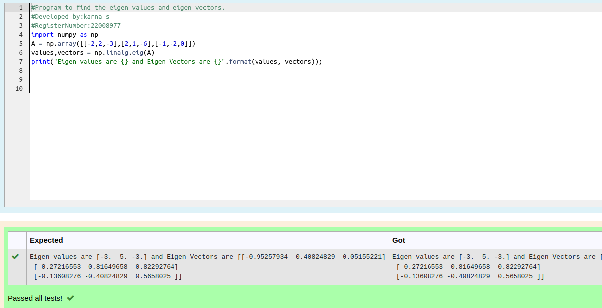

# EIGENVALUES-AND-EIGENVECTORS
## Aim:
To write a python program to find the Eigenvalues and Eigen Vectors
## Equipment’s required:
1. 	Hardware – PCs
2. 	Anaconda – Python 3.7 Installation / Moodle-Code Runner
## Algorithm:
### Step1 :Import the numpy module to use the built-in functiosn for calculations
### Step 2: Prepare the lists from each linear equations and assign in
np.array()
### Step 3: Using the np.linalg.solve(), we can find the solutions
### Step 4: End the program

## Program:
```python
#Program to find the eigen values and eigen vectors.
#Developed by:karna s 
#RegisterNumber:22008977
import numpy as np
A = np.array([[-2,2,-3],[2,1,-6],[-1,-2,0]]) 
values,vectors = np.linalg.eig(A)
print("Eigen values are {} and Eigen Vectors are {}".format(values, vectors));

```

## Output:

## Result:
Thus the Eigenvalue and Eigenvector is successfully solved using python program
